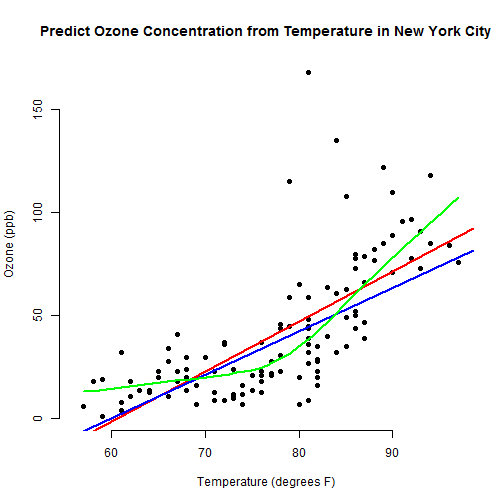

## Introduction

The purpose of this Shiny Application is to predict ozone concentration from temperature in New York City based upon the following dataset:

http://stat.ethz.ch/R-manual/R-devel/library/datasets/html/quakes.html

I develop three different models for prediction:

1. Linear Regression on all data [red]
2. Linear Regression without Ozone outliers [blue]
3. LOESS (curve fitting local polynomial regression) on all data [green]

https://papazian.shinyapps.io/OzoneApp/

My first model is a simpe regression. There are a few ozone outliers (> 100 ppb), so I develop a special linear model to account for potential measurement error. Additionally, I develop a LOESS curve because there appears to be a non-linear relationship.

---

## Plot in Shiny App



---

## User Interface Code in R


```r
library(shiny)
shinyUI(fluidPage(
  titlePanel("Predict Ozone Concentration from Temperature in New York City"),
  h5("by John P. on December 30, 2016"),
  h5("data source:  http://stat.ethz.ch/R-manual/R-devel/library/datasets/html/airquality.html"),
  sidebarLayout(
    sidebarPanel(
      sliderInput("sliderTemp", "What is the temperature (degrees F)?", 50, 100, value = 85),
      checkboxInput("showModel1", "Show/Hide Model 1: Linear Regression on all data", value = TRUE),
      checkboxInput("showModel2", "Show/Hide Model 2: Linear Regression without Ozone outliers", value = TRUE),
      checkboxInput("showModel3", "Show/Hide Model 3: LOESS (curve fitting local polynomial regression) on all data", value = TRUE)
    ),
    mainPanel(
      plotOutput("plot1"),
      h5("Predicted Ozone from Model 1: Linear Regression on all data"),
      textOutput("pred1"),
      h5("Predicted Ozone from Model 2: Linear Regression without Ozone outliers"),
      textOutput("pred2"),
      h5("Predicted Ozone from Model 3: LOESS (curve fitting local polynomial regression) on all data"),
      textOutput("pred3")
    )
  )
))
```

---

## Server Code in R


```r
library(shiny)
shinyServer(function(input, output) 
{
  
  model1 <- lm(Ozone ~ Temp, data=airquality)
  model2 <- lm(Ozone ~ Temp, data=subset(airquality, Ozone < 100))
  model3 <- loess(Ozone ~ Temp, data=airquality)
  
  model1pred <- reactive(
  {
    TempInput <- input$sliderTemp
    predict(model1, newdata = data.frame(Temp = TempInput))
  })
  
  model2pred <- reactive(
  {
    TempInput <- input$sliderTemp
    predict(model2, newdata = data.frame(Temp = TempInput))
  })
  
  model3pred <- reactive(
  {
    TempInput <- input$sliderTemp
    predict(model3, newdata = data.frame(Temp = TempInput))
  })
  
  output$plot1 <- renderPlot(
  {
    TempInput <- input$sliderTemp
    
    plot(x=airquality$Temp, y=airquality$Ozone, xlab="Temperature (degrees F)", ylab="Ozone (ppb)", bty = "n", pch = 16)
    
    if(input$showModel1)
    {
      abline(model1, col = "red", lwd = 2)
    }
    if(input$showModel2)
    {
      abline(model2, col = "blue", lwd = 2)
    }
    if(input$showModel3)
    {
      model3smooth <- loess.smooth(airquality$Temp, airquality$Ozone, span = 2/3, degree = 1, family = c("symmetric", "gaussian"), evaluation=50, data=airquality)
      lines(model3smooth, col = "green", lwd = 2)
    }

    points(TempInput, model1pred(), col = "red", pch = 16, cex = 2)
    points(TempInput, model2pred(), col = "blue", pch = 16, cex = 2)
    points(TempInput, model3pred(), col = "green", pch = 16, cex = 2)
  })
  
  output$pred1 <- renderText(
  {
    model1pred()
  })
  
  output$pred2 <- renderText(
  {
    model2pred()
  })
  
  output$pred3 <- renderText(
  {
    model3pred()
  })
})
```
---
